# توثيق قاعدة بيانات صناع

> توثيق شامل لهيكل قاعدة البيانات مستخرج من ملفات الترحيل (Migrations).

---

## جدول المحتويات
1. [نظرة عامة](#نظرة-عامة)
2. [الجداول وخصائصها](#الجداول-وخصائصها)
3. [مخطط العلاقات (ERD)](#مخطط-العلاقات-erd)
4. [مخطط تدفق البيانات (DFD)](#مخطط-تدفق-البيانات-dfd)
5. [ملخص العلاقات](#ملخص-العلاقات)
6. [مرجع القيود](#مرجع-القيود)
7. [مرجع الفهارس](#مرجع-الفهارس)

---

## نظرة عامة

تتكون قاعدة بيانات صناع من **17 جدول** منظمة في المجالات الوظيفية التالية:

| المجال | الجداول |
|--------|---------|
| **إدارة المستخدمين** | `users` |
| **إدارة المشاريع/المتاجر** | `projects`، `user_favorites` |
| **كتالوج المنتجات** | `categories`، `products`، `product_images`، `product_variants`، `tags`، `product_tags` |
| **التسوق** | `cart_items` |
| **التواصل** | `conversations`، `messages` |
| **المعاملات** | `transactions`، `reviews` |
| **الدعم** | `support_tickets`، `notifications` |
| **النظام** | `system_settings` |

---

## الجداول وخصائصها

### 1. جدول `users` (المستخدمون)
جدول المستخدمين المركزي لتخزين جميع حسابات المستخدمين.

| العمود | النوع | القيود | الوصف |
|--------|------|--------|-------|
| `id` | عدد صحيح | **مفتاح أساسي**، تزايد تلقائي | معرف المستخدم الفريد |
| `email` | نص (255) | **فريد**، إلزامي | البريد الإلكتروني |
| `password_hash` | نص (255) | إلزامي | كلمة المرور المشفرة |
| `phone` | نص (20) | اختياري | رقم الهاتف |
| `full_name` | نص (100) | إلزامي | الاسم الكامل |
| `avatar_url` | نص (500) | اختياري | رابط صورة الملف الشخصي |
| `role` | قائمة اختيار | افتراضي 'customer' | `customer`، `project_owner`، `admin` |
| `language` | قائمة اختيار | افتراضي 'ar' | `ar`، `en` |
| `is_active` | منطقي | افتراضي true | حالة تفعيل الحساب |
| `is_banned` | منطقي | افتراضي false | حالة الحظر |
| `ban_reason` | نص طويل | اختياري | سبب الحظر |
| `refresh_token` | نص (500) | اختياري | رمز التحديث JWT |
| `created_at` | تاريخ ووقت | افتراضي الوقت الحالي | تاريخ الإنشاء |
| `updated_at` | تاريخ ووقت | تحديث تلقائي | تاريخ آخر تحديث |

**الفهارس:** `email`، `role`، `is_active`

---

### 2. جدول `projects` (المشاريع)
يخزن معلومات المشاريع/المتاجر لأصحاب المشاريع.

| العمود | النوع | القيود | الوصف |
|--------|------|--------|-------|
| `id` | عدد صحيح | **مفتاح أساسي**، تزايد تلقائي | معرف المشروع الفريد |
| `owner_id` | عدد صحيح | **مفتاح خارجي→users.id**، **فريد**، إلزامي | مرجع صاحب المشروع |
| `name` | نص (100) | إلزامي | اسم المشروع (إنجليزي) |
| `name_ar` | نص (100) | إلزامي | اسم المشروع (عربي) |
| `description` | نص طويل | اختياري | الوصف (إنجليزي) |
| `description_ar` | نص طويل | اختياري | الوصف (عربي) |
| `logo_url` | نص (500) | اختياري | رابط الشعار |
| `cover_url` | نص (500) | اختياري | رابط صورة الغلاف |
| `city` | نص (100) | إلزامي | المدينة |
| `latitude` | عشري (10,8) | اختياري | خط العرض GPS |
| `longitude` | عشري (11,8) | اختياري | خط الطول GPS |
| `working_hours` | JSON | اختياري | جدول ساعات العمل |
| `social_links` | JSON | اختياري | روابط التواصل الاجتماعي |
| `status` | قائمة اختيار | افتراضي 'pending' | `pending`، `approved`، `rejected`، `disabled` |
| `rejection_reason` | نص طويل | اختياري | سبب الرفض |
| `disable_reason` | نص طويل | اختياري | سبب التعطيل |
| `average_rating` | عشري (2,1) | افتراضي 0 | متوسط التقييم |
| `total_reviews` | عدد صحيح | افتراضي 0 | عدد المراجعات |
| `created_at` | تاريخ ووقت | افتراضي الوقت الحالي | تاريخ الإنشاء |
| `updated_at` | تاريخ ووقت | تحديث تلقائي | تاريخ آخر تحديث |

**الفهارس:** `owner_id`، `status`، `city`، `average_rating`

**إجراءات المفتاح الخارجي:** حذف تسلسلي، تحديث تسلسلي

---

### 3. جدول `categories` (الفئات)
فئات المنتجات مع دعم التسلسل الهرمي.

| العمود | النوع | القيود | الوصف |
|--------|------|--------|-------|
| `id` | عدد صحيح | **مفتاح أساسي**، تزايد تلقائي | معرف الفئة الفريد |
| `parent_id` | عدد صحيح | **مفتاح خارجي→categories.id**، اختياري | الفئة الأب (مرجع ذاتي) |
| `name` | نص (100) | إلزامي | اسم الفئة (إنجليزي) |
| `name_ar` | نص (100) | إلزامي | اسم الفئة (عربي) |
| `icon` | نص (100) | اختياري | معرف الأيقونة |
| `sort_order` | عدد صحيح | افتراضي 0 | ترتيب العرض |
| `is_active` | منطقي | افتراضي true | حالة النشاط |
| `status` | قائمة اختيار | افتراضي 'active' | `active`، `inactive`، `pending`، `rejected` |
| `created_by` | عدد صحيح | **مفتاح خارجي→users.id**، اختياري | المستخدم الذي أنشأ الفئة |
| `rejection_reason` | نص (255) | اختياري | سبب الرفض |
| `created_at` | تاريخ ووقت | افتراضي الوقت الحالي | تاريخ الإنشاء |

**الفهارس:** `parent_id`، `is_active`، `sort_order`، `status`

---

### 4. جدول `products` (المنتجات)
الجدول الرئيسي لكتالوج المنتجات.

| العمود | النوع | القيود | الوصف |
|--------|------|--------|-------|
| `id` | عدد صحيح | **مفتاح أساسي**، تزايد تلقائي | معرف المنتج الفريد |
| `project_id` | عدد صحيح | **مفتاح خارجي→projects.id**، إلزامي | مرجع المشروع |
| `category_id` | عدد صحيح | **مفتاح خارجي→categories.id**، إلزامي | مرجع الفئة |
| `name` | نص (200) | إلزامي | اسم المنتج (إنجليزي) |
| `name_ar` | نص (200) | إلزامي | اسم المنتج (عربي) |
| `description` | نص طويل | اختياري | الوصف (إنجليزي) |
| `description_ar` | نص طويل | اختياري | الوصف (عربي) |
| `base_price` | عشري (10,2) | إلزامي | السعر الأساسي |
| `poster_image_url` | نص (500) | إلزامي | صورة المنتج الرئيسية |
| `quantity` | عدد صحيح | افتراضي 0 | كمية المخزون |
| `is_available` | منطقي | افتراضي true | حالة التوفر |
| `status` | قائمة اختيار | افتراضي 'pending' | `pending`، `approved`، `rejected` |
| `rejection_reason` | نص طويل | اختياري | سبب الرفض |
| `average_rating` | عشري (2,1) | افتراضي 0 | متوسط التقييم |
| `total_reviews` | عدد صحيح | افتراضي 0 | عدد المراجعات |
| `view_count` | عدد صحيح | افتراضي 0 | عداد المشاهدات |
| `created_at` | تاريخ ووقت | افتراضي الوقت الحالي | تاريخ الإنشاء |
| `updated_at` | تاريخ ووقت | تحديث تلقائي | تاريخ آخر تحديث |

**الفهارس:** `project_id`، `category_id`، `status`، `is_available`، `average_rating`، `created_at`

---

### 5. جدول `product_images` (صور المنتجات)
صور إضافية للمنتجات.

| العمود | النوع | القيود | الوصف |
|--------|------|--------|-------|
| `id` | عدد صحيح | **مفتاح أساسي**، تزايد تلقائي | معرف الصورة الفريد |
| `product_id` | عدد صحيح | **مفتاح خارجي→products.id**، إلزامي | مرجع المنتج |
| `image_url` | نص (500) | إلزامي | رابط الصورة |
| `sort_order` | عدد صحيح | افتراضي 0 | ترتيب العرض |
| `created_at` | تاريخ ووقت | افتراضي الوقت الحالي | تاريخ الإنشاء |

---

### 6. جدول `product_variants` (متغيرات المنتجات)
متغيرات المنتج (أحجام، ألوان، إلخ).

| العمود | النوع | القيود | الوصف |
|--------|------|--------|-------|
| `id` | عدد صحيح | **مفتاح أساسي**، تزايد تلقائي | معرف المتغير الفريد |
| `product_id` | عدد صحيح | **مفتاح خارجي→products.id**، إلزامي | مرجع المنتج |
| `name` | نص (100) | إلزامي | اسم المتغير (إنجليزي) |
| `name_ar` | نص (100) | إلزامي | اسم المتغير (عربي) |
| `price_modifier` | عشري (10,2) | افتراضي 0 | تعديل السعر |
| `quantity` | عدد صحيح | افتراضي 0 | كمية المخزون |
| `is_available` | منطقي | افتراضي true | حالة التوفر |
| `created_at` | تاريخ ووقت | افتراضي الوقت الحالي | تاريخ الإنشاء |

---

### 7. جدول `tags` (الوسوم)
وسوم المنتجات للتصنيف.

| العمود | النوع | القيود | الوصف |
|--------|------|--------|-------|
| `id` | عدد صحيح | **مفتاح أساسي**، تزايد تلقائي | معرف الوسم الفريد |
| `name` | نص (50) | إلزامي | اسم الوسم (إنجليزي) |
| `name_ar` | نص (50) | إلزامي | اسم الوسم (عربي) |
| `created_at` | تاريخ ووقت | افتراضي الوقت الحالي | تاريخ الإنشاء |

---

### 8. جدول `product_tags` (جدول وسيط)
علاقة متعدد-لـ-متعدد بين المنتجات والوسوم.

| العمود | النوع | القيود | الوصف |
|--------|------|--------|-------|
| `product_id` | عدد صحيح | **مفتاح أساسي**، **مفتاح خارجي→products.id**، إلزامي | مرجع المنتج |
| `tag_id` | عدد صحيح | **مفتاح أساسي**، **مفتاح خارجي→tags.id**، إلزامي | مرجع الوسم |

**مفتاح أساسي مركب:** (`product_id`، `tag_id`)

---

### 9. جدول `cart_items` (عناصر السلة)
عناصر سلة التسوق للمستخدم.

| العمود | النوع | القيود | الوصف |
|--------|------|--------|-------|
| `id` | عدد صحيح | **مفتاح أساسي**، تزايد تلقائي | معرف العنصر الفريد |
| `user_id` | عدد صحيح | **مفتاح خارجي→users.id**، إلزامي | مرجع المستخدم |
| `product_id` | عدد صحيح | **مفتاح خارجي→products.id**، إلزامي | مرجع المنتج |
| `variant_id` | عدد صحيح | **مفتاح خارجي→product_variants.id**، اختياري | مرجع المتغير |
| `quantity` | عدد صحيح | افتراضي 1 | الكمية |
| `note` | نص طويل | اختياري | ملاحظة اختيارية |
| `created_at` | تاريخ ووقت | افتراضي الوقت الحالي | تاريخ الإنشاء |

**قيد فريد:** `unique_cart_item` على (`user_id`، `product_id`، `variant_id`)

---

### 10. جدول `conversations` (المحادثات)
محادثات الدردشة بين المستخدمين.

| العمود | النوع | القيود | الوصف |
|--------|------|--------|-------|
| `id` | عدد صحيح | **مفتاح أساسي**، تزايد تلقائي | معرف المحادثة الفريد |
| `user1_id` | عدد صحيح | **مفتاح خارجي→users.id**، إلزامي | المستخدم الأول (ID الأصغر) |
| `user2_id` | عدد صحيح | **مفتاح خارجي→users.id**، إلزامي | المستخدم الثاني (ID الأكبر) |
| `project_id` | عدد صحيح | **مفتاح خارجي→projects.id**، اختياري | سياق المشروع المرتبط |
| `last_message_at` | تاريخ ووقت | اختياري | تاريخ آخر رسالة |
| `created_at` | تاريخ ووقت | افتراضي الوقت الحالي | تاريخ الإنشاء |

**قيد فريد:** `unique_user_pair` على (`user1_id`، `user2_id`)

---

### 11. جدول `messages` (الرسائل)
رسائل الدردشة داخل المحادثات.

| العمود | النوع | القيود | الوصف |
|--------|------|--------|-------|
| `id` | عدد صحيح | **مفتاح أساسي**، تزايد تلقائي | معرف الرسالة الفريد |
| `conversation_id` | عدد صحيح | **مفتاح خارجي→conversations.id**، إلزامي | مرجع المحادثة |
| `sender_id` | عدد صحيح | **مفتاح خارجي→users.id**، إلزامي | مرجع المرسل |
| `content` | نص طويل | إلزامي | محتوى الرسالة |
| `message_type` | قائمة اختيار | افتراضي 'text' | `text`، `inquiry`، `image`، `transaction` |
| `is_read` | منطقي | افتراضي false | حالة القراءة |
| `created_at` | تاريخ ووقت | افتراضي الوقت الحالي | تاريخ الإنشاء |

---

### 12. جدول `transactions` (المعاملات)
معاملات الشراء بين المستخدمين.

| العمود | النوع | القيود | الوصف |
|--------|------|--------|-------|
| `id` | عدد صحيح | **مفتاح أساسي**، تزايد تلقائي | معرف المعاملة الفريد |
| `conversation_id` | عدد صحيح | **مفتاح خارجي→conversations.id**، إلزامي | المحادثة المرتبطة |
| `product_id` | عدد صحيح | **مفتاح خارجي→products.id**، اختياري | المنتج المرتبط |
| `initiated_by` | عدد صحيح | **مفتاح خارجي→users.id**، إلزامي | المستخدم الذي بدأ المعاملة |
| `customer_confirmed` | منطقي | افتراضي false | تأكيد العميل |
| `seller_confirmed` | منطقي | افتراضي false | تأكيد البائع |
| `customer_confirmed_at` | تاريخ ووقت | اختياري | وقت تأكيد العميل |
| `seller_confirmed_at` | تاريخ ووقت | اختياري | وقت تأكيد البائع |
| `status` | قائمة اختيار | افتراضي 'pending' | `pending`، `confirmed`، `disputed`، `cancelled` |
| `auto_confirm_at` | تاريخ ووقت | إلزامي | موعد التأكيد التلقائي |
| `created_at` | تاريخ ووقت | افتراضي الوقت الحالي | تاريخ الإنشاء |

---

### 13. جدول `reviews` (المراجعات)
مراجعات المنتجات من العملاء.

| العمود | النوع | القيود | الوصف |
|--------|------|--------|-------|
| `id` | عدد صحيح | **مفتاح أساسي**، تزايد تلقائي | معرف المراجعة الفريد |
| `product_id` | عدد صحيح | **مفتاح خارجي→products.id**، إلزامي | المنتج المُراجَع |
| `user_id` | عدد صحيح | **مفتاح خارجي→users.id**، إلزامي | المُراجِع |
| `transaction_id` | عدد صحيح | **مفتاح خارجي→transactions.id**، إلزامي | المعاملة المرتبطة |
| `rating` | عدد صغير | إلزامي، نطاق (1-5) | درجة التقييم |
| `comment` | نص طويل | اختياري | تعليق المراجعة |
| `status` | قائمة اختيار | افتراضي 'pending' | `pending`، `approved`، `rejected` |
| `created_at` | تاريخ ووقت | افتراضي الوقت الحالي | تاريخ الإنشاء |

**قيد فريد:** `unique_review` على (`product_id`، `user_id`، `transaction_id`)

---

### 14. جدول `support_tickets` (تذاكر الدعم)
تذاكر دعم العملاء.

| العمود | النوع | القيود | الوصف |
|--------|------|--------|-------|
| `id` | عدد صحيح | **مفتاح أساسي**، تزايد تلقائي | معرف التذكرة الفريد |
| `user_id` | عدد صحيح | **مفتاح خارجي→users.id**، إلزامي | منشئ التذكرة |
| `type` | قائمة اختيار | إلزامي | `general`، `dispute`، `report`، `feedback` |
| `subject` | نص (200) | إلزامي | موضوع التذكرة |
| `description` | نص طويل | إلزامي | وصف التذكرة |
| `related_id` | عدد صحيح | اختياري | معرف الكيان المرتبط |
| `related_type` | نص (50) | اختياري | نوع المرجع |
| `status` | قائمة اختيار | افتراضي 'open' | `open`، `in_progress`، `resolved`، `closed` |
| `assigned_to` | عدد صحيح | **مفتاح خارجي→users.id**، اختياري | المسؤول المعين |
| `resolution` | نص طويل | اختياري | ملاحظات الحل |
| `created_at` | تاريخ ووقت | افتراضي الوقت الحالي | تاريخ الإنشاء |
| `updated_at` | تاريخ ووقت | تحديث تلقائي | تاريخ آخر تحديث |

---

### 15. جدول `notifications` (الإشعارات)
إشعارات المستخدم.

| العمود | النوع | القيود | الوصف |
|--------|------|--------|-------|
| `id` | عدد صحيح | **مفتاح أساسي**، تزايد تلقائي | معرف الإشعار الفريد |
| `user_id` | عدد صحيح | **مفتاح خارجي→users.id**، إلزامي | المستخدم المستهدف |
| `type` | نص (50) | إلزامي | نوع الإشعار |
| `title` | نص (200) | إلزامي | العنوان (إنجليزي) |
| `title_ar` | نص (200) | إلزامي | العنوان (عربي) |
| `body` | نص طويل | اختياري | المحتوى (إنجليزي) |
| `body_ar` | نص طويل | اختياري | المحتوى (عربي) |
| `data` | JSON | اختياري | بيانات إضافية |
| `is_read` | منطقي | افتراضي false | حالة القراءة |
| `created_at` | تاريخ ووقت | افتراضي الوقت الحالي | تاريخ الإنشاء |

---

### 16. جدول `system_settings` (إعدادات النظام)
إعدادات تكوين التطبيق.

| العمود | النوع | القيود | الوصف |
|--------|------|--------|-------|
| `id` | عدد صحيح | **مفتاح أساسي**، تزايد تلقائي | معرف الإعداد الفريد |
| `setting_key` | نص (100) | **فريد**، إلزامي | مفتاح الإعداد |
| `setting_value` | نص طويل | إلزامي | قيمة الإعداد |
| `description` | نص (255) | اختياري | وصف الإعداد |
| `updated_at` | تاريخ ووقت | تحديث تلقائي | تاريخ آخر تحديث |

---

### 17. جدول `user_favorites` (مفضلات المستخدم)
المشاريع المفضلة للمستخدم.

| العمود | النوع | القيود | الوصف |
|--------|------|--------|-------|
| `id` | عدد صحيح | **مفتاح أساسي**، تزايد تلقائي | معرف المفضلة الفريد |
| `user_id` | عدد صحيح | **مفتاح خارجي→users.id**، إلزامي | مرجع المستخدم |
| `project_id` | عدد صحيح | **مفتاح خارجي→projects.id**، إلزامي | المشروع المفضل |
| `created_at` | تاريخ ووقت | افتراضي الوقت الحالي | تاريخ الإنشاء |

**قيد فريد:** `user_favorites_user_project_unique` على (`user_id`، `project_id`)

---

## مخطط العلاقات (ERD)

```mermaid
erDiagram
    users ||--o| projects : "يملك (1:1)"
    users ||--o{ cart_items : "لديه"
    users ||--o{ conversations : "يشارك (كمستخدم1)"
    users ||--o{ conversations : "يشارك (كمستخدم2)"
    users ||--o{ messages : "يرسل"
    users ||--o{ transactions : "يبدأ"
    users ||--o{ reviews : "يكتب"
    users ||--o{ support_tickets : "ينشئ"
    users ||--o{ support_tickets : "معين_لـ"
    users ||--o{ notifications : "يستلم"
    users ||--o{ user_favorites : "لديه"
    users ||--o{ categories : "ينشئ"
    
    projects ||--o{ products : "يحتوي"
    projects ||--o{ conversations : "سياق"
    projects ||--o{ user_favorites : "مفضل_بواسطة"
    
    categories ||--o| categories : "أب_لـ"
    categories ||--o{ products : "يصنف"
    
    products ||--o{ product_images : "لديه"
    products ||--o{ product_variants : "لديه"
    products ||--o{ product_tags : "موسوم_بـ"
    products ||--o{ cart_items : "في"
    products ||--o{ transactions : "مرتبط_بـ"
    products ||--o{ reviews : "مُراجَع_في"
    
    tags ||--o{ product_tags : "مطبق_على"
    
    product_variants ||--o{ cart_items : "مختار_في"
    
    conversations ||--o{ messages : "يحتوي"
    conversations ||--o{ transactions : "مرتبط_بـ"
    
    transactions ||--o{ reviews : "يمكّن"

    users {
        int id مفتاح_أساسي
        string email فريد
        string password_hash
        string phone
        string full_name
        string avatar_url
        enum role
        enum language
        boolean is_active
        boolean is_banned
        text ban_reason
        string refresh_token
        timestamp created_at
        timestamp updated_at
    }
    
    projects {
        int id مفتاح_أساسي
        int owner_id مفتاح_خارجي_فريد
        string name
        string name_ar
        text description
        text description_ar
        string logo_url
        string cover_url
        string city
        decimal latitude
        decimal longitude
        json working_hours
        json social_links
        enum status
        text rejection_reason
        text disable_reason
        decimal average_rating
        int total_reviews
        timestamp created_at
        timestamp updated_at
    }
    
    categories {
        int id مفتاح_أساسي
        int parent_id مفتاح_خارجي
        string name
        string name_ar
        string icon
        int sort_order
        boolean is_active
        enum status
        int created_by مفتاح_خارجي
        string rejection_reason
        timestamp created_at
    }
    
    products {
        int id مفتاح_أساسي
        int project_id مفتاح_خارجي
        int category_id مفتاح_خارجي
        string name
        string name_ar
        text description
        text description_ar
        decimal base_price
        string poster_image_url
        int quantity
        boolean is_available
        enum status
        text rejection_reason
        decimal average_rating
        int total_reviews
        int view_count
        timestamp created_at
        timestamp updated_at
    }
    
    product_images {
        int id مفتاح_أساسي
        int product_id مفتاح_خارجي
        string image_url
        int sort_order
        timestamp created_at
    }
    
    product_variants {
        int id مفتاح_أساسي
        int product_id مفتاح_خارجي
        string name
        string name_ar
        decimal price_modifier
        int quantity
        boolean is_available
        timestamp created_at
    }
    
    tags {
        int id مفتاح_أساسي
        string name
        string name_ar
        timestamp created_at
    }
    
    product_tags {
        int product_id مفتاح_أساسي_خارجي
        int tag_id مفتاح_أساسي_خارجي
    }
    
    cart_items {
        int id مفتاح_أساسي
        int user_id مفتاح_خارجي
        int product_id مفتاح_خارجي
        int variant_id مفتاح_خارجي
        int quantity
        text note
        timestamp created_at
    }
    
    conversations {
        int id مفتاح_أساسي
        int user1_id مفتاح_خارجي
        int user2_id مفتاح_خارجي
        int project_id مفتاح_خارجي
        timestamp last_message_at
        timestamp created_at
    }
    
    messages {
        int id مفتاح_أساسي
        int conversation_id مفتاح_خارجي
        int sender_id مفتاح_خارجي
        text content
        enum message_type
        boolean is_read
        timestamp created_at
    }
    
    transactions {
        int id مفتاح_أساسي
        int conversation_id مفتاح_خارجي
        int product_id مفتاح_خارجي
        int initiated_by مفتاح_خارجي
        boolean customer_confirmed
        boolean seller_confirmed
        timestamp customer_confirmed_at
        timestamp seller_confirmed_at
        enum status
        timestamp auto_confirm_at
        timestamp created_at
    }
    
    reviews {
        int id مفتاح_أساسي
        int product_id مفتاح_خارجي
        int user_id مفتاح_خارجي
        int transaction_id مفتاح_خارجي
        tinyint rating
        text comment
        enum status
        timestamp created_at
    }
    
    support_tickets {
        int id مفتاح_أساسي
        int user_id مفتاح_خارجي
        enum type
        string subject
        text description
        int related_id
        string related_type
        enum status
        int assigned_to مفتاح_خارجي
        text resolution
        timestamp created_at
        timestamp updated_at
    }
    
    notifications {
        int id مفتاح_أساسي
        int user_id مفتاح_خارجي
        string type
        string title
        string title_ar
        text body
        text body_ar
        json data
        boolean is_read
        timestamp created_at
    }
    
    system_settings {
        int id مفتاح_أساسي
        string setting_key فريد
        text setting_value
        string description
        timestamp updated_at
    }
    
    user_favorites {
        int id مفتاح_أساسي
        int user_id مفتاح_خارجي
        int project_id مفتاح_خارجي
        timestamp created_at
    }
```

---

## مخطط تدفق البيانات (DFD)

```mermaid
flowchart TB
    subgraph External["الكيانات الخارجية"]
        CUSTOMER["👤 العميل"]
        PROJECT_OWNER["🏪 صاحب المشروع"]
        ADMIN["👨‍💼 المسؤول"]
    end
    
    subgraph Processes["العمليات الأساسية"]
        P1["1.0 إدارة المستخدمين"]
        P2["2.0 إدارة المشاريع"]
        P3["3.0 إدارة المنتجات"]
        P4["4.0 سلة التسوق"]
        P5["5.0 نظام المراسلة"]
        P6["6.0 معالجة المعاملات"]
        P7["7.0 نظام المراجعات"]
        P8["8.0 نظام الدعم"]
        P9["9.0 نظام الإشعارات"]
    end
    
    subgraph DataStores["مخازن البيانات"]
        D1[("users المستخدمون")]
        D2[("projects المشاريع")]
        D3[("categories الفئات")]
        D4[("products المنتجات")]
        D5[("product_images الصور")]
        D6[("product_variants المتغيرات")]
        D7[("tags/product_tags الوسوم")]
        D8[("cart_items السلة")]
        D9[("conversations المحادثات")]
        D10[("messages الرسائل")]
        D11[("transactions المعاملات")]
        D12[("reviews المراجعات")]
        D13[("support_tickets التذاكر")]
        D14[("notifications الإشعارات")]
        D15[("system_settings الإعدادات")]
        D16[("user_favorites المفضلات")]
    end
    
    %% تدفقات المستخدم
    CUSTOMER -->|"تسجيل/دخول"| P1
    PROJECT_OWNER -->|"تسجيل/دخول"| P1
    ADMIN -->|"دخول"| P1
    P1 <-->|"بيانات المستخدم"| D1
    
    %% تدفقات المشروع
    PROJECT_OWNER -->|"إنشاء/تعديل المشروع"| P2
    ADMIN -->|"موافقة/رفض المشروع"| P2
    P2 <-->|"بيانات المشروع"| D2
    
    %% تدفقات المنتج
    PROJECT_OWNER -->|"إضافة/تعديل المنتجات"| P3
    ADMIN -->|"موافقة/رفض المنتجات"| P3
    P3 <-->|"بيانات المنتج"| D4
    P3 <-->|"الصور"| D5
    P3 <-->|"المتغيرات"| D6
    P3 <-->|"الفئات"| D3
    P3 <-->|"الوسوم"| D7
    
    %% تدفقات التسوق
    CUSTOMER -->|"إضافة للسلة"| P4
    P4 <-->|"عناصر السلة"| D8
    P4 -.->|"فحص المنتجات"| D4
    P4 -.->|"فحص المتغيرات"| D6
    
    %% تدفقات المراسلة
    CUSTOMER -->|"إرسال رسالة"| P5
    PROJECT_OWNER -->|"رد على الرسالة"| P5
    P5 <-->|"المحادثات"| D9
    P5 <-->|"الرسائل"| D10
    
    %% تدفقات المعاملات
    CUSTOMER -->|"تأكيد الشراء"| P6
    PROJECT_OWNER -->|"تأكيد البيع"| P6
    P6 <-->|"بيانات المعاملة"| D11
    P6 -.->|"تحديث عبر"| D10
    
    %% تدفقات المراجعات
    CUSTOMER -->|"كتابة مراجعة"| P7
    ADMIN -->|"إدارة المراجعة"| P7
    P7 <-->|"المراجعات"| D12
    P7 -.->|"يتطلب"| D11
    
    %% تدفقات الدعم
    CUSTOMER -->|"إنشاء تذكرة"| P8
    PROJECT_OWNER -->|"إنشاء تذكرة"| P8
    ADMIN -->|"معالجة التذكرة"| P8
    P8 <-->|"التذاكر"| D13
    
    %% تدفقات الإشعارات
    P1 & P2 & P3 & P6 & P7 & P8 -->|"تحفيز"| P9
    P9 <-->|"الإشعارات"| D14
    P9 -->|"إشعار فوري"| CUSTOMER
    P9 -->|"إشعار فوري"| PROJECT_OWNER
    
    %% المفضلات
    CUSTOMER -->|"إضافة للمفضلة"| D16
    
    %% إعدادات النظام
    ADMIN -->|"تكوين"| D15
```



---

## ملخص العلاقات

### علاقات واحد-لـ-واحد (1:1)
| الجدول الأب | الجدول التابع | عمود المفتاح الخارجي | الوصف |
|-------------|--------------|----------------------|-------|
| `users` | `projects` | `owner_id` | كل مستخدم يمكنه امتلاك مشروع واحد |

### علاقات واحد-لـ-متعدد (1:N)
| الجدول الأب | الجدول التابع | عمود المفتاح الخارجي | الوصف |
|-------------|--------------|----------------------|-------|
| `users` | `cart_items` | `user_id` | عناصر سلة المستخدم |
| `users` | `support_tickets` | `user_id` | تذاكر المستخدم |
| `users` | `notifications` | `user_id` | إشعارات المستخدم |
| `users` | `reviews` | `user_id` | مراجعات المستخدم |
| `users` | `messages` | `sender_id` | رسائل المستخدم المرسلة |
| `users` | `transactions` | `initiated_by` | معاملات المستخدم |
| `users` | `user_favorites` | `user_id` | مفضلات المستخدم |
| `users` | `categories` | `created_by` | فئات أنشأها المستخدم |
| `projects` | `products` | `project_id` | منتجات المشروع |
| `projects` | `conversations` | `project_id` | محادثات متعلقة بالمشروع |
| `projects` | `user_favorites` | `project_id` | المستخدمون الذين فضلوا المشروع |
| `categories` | `categories` | `parent_id` | التسلسل الهرمي للفئات (مرجع ذاتي) |
| `categories` | `products` | `category_id` | منتجات في الفئة |
| `products` | `product_images` | `product_id` | صور المنتج |
| `products` | `product_variants` | `product_id` | متغيرات المنتج |
| `products` | `cart_items` | `product_id` | عناصر السلة مع المنتج |
| `products` | `reviews` | `product_id` | مراجعات المنتج |
| `products` | `transactions` | `product_id` | المعاملات المرتبطة |
| `product_variants` | `cart_items` | `variant_id` | عناصر السلة مع المتغير |
| `conversations` | `messages` | `conversation_id` | الرسائل في المحادثة |
| `conversations` | `transactions` | `conversation_id` | المعاملات من المحادثة |
| `transactions` | `reviews` | `transaction_id` | المراجعات للمعاملة |

### علاقات متعدد-لـ-متعدد (N:M)
| الجدول 1 | الجدول 2 | الجدول الوسيط | الوصف |
|---------|---------|--------------|-------|
| `products` | `tags` | `product_tags` | وسم المنتجات |
| `users` | `users` | `conversations` | محادثات المستخدمين |

---

## مرجع القيود

### المفاتيح الأساسية
جميع الجداول تستخدم `id` (عدد صحيح، تزايد تلقائي) كمفتاح أساسي، باستثناء:
- `product_tags`: مفتاح أساسي مركب (`product_id`، `tag_id`)

### القيود الفريدة
| الجدول | الأعمدة | اسم القيد |
|--------|---------|-----------|
| `users` | `email` | (ضمني) |
| `projects` | `owner_id` | (ضمني) |
| `system_settings` | `setting_key` | (ضمني) |
| `cart_items` | `user_id`، `product_id`، `variant_id` | `unique_cart_item` |
| `conversations` | `user1_id`، `user2_id` | `unique_user_pair` |
| `reviews` | `product_id`، `user_id`، `transaction_id` | `unique_review` |
| `user_favorites` | `user_id`، `project_id` | `user_favorites_user_project_unique` |

### ملخص إجراءات المفاتيح الخارجية

| الإجراء | الاستخدام |
|---------|----------|
| `CASCADE` | الأكثر شيوعاً - الحذف/التحديث ينتشر |
| `SET NULL` | علاقات أب-ابن حيث يمكن للابن الوجود بدون الأب |
| `RESTRICT` | علاقات حرجة يجب الحفاظ عليها |

---

## مرجع الفهارس

| الجدول | الأعمدة المفهرسة |
|--------|-----------------|
| `users` | `email`، `role`، `is_active` |
| `projects` | `owner_id`، `status`، `city`، `average_rating` |
| `categories` | `parent_id`، `is_active`، `sort_order`، `status` |
| `products` | `project_id`، `category_id`، `status`، `is_available`، `average_rating`، `created_at` |
| `product_images` | `product_id` |
| `product_variants` | `product_id`، `is_available` |
| `product_tags` | `product_id`، `tag_id` |
| `cart_items` | `user_id`، `product_id` |
| `conversations` | `user1_id`، `user2_id`، `project_id`، `last_message_at` |
| `messages` | `conversation_id`، `sender_id`، `is_read`، `created_at` |
| `transactions` | `conversation_id`، `product_id`، `initiated_by`، `status`، `auto_confirm_at` |
| `reviews` | `product_id`، `user_id`، `status`، `rating` |
| `support_tickets` | `user_id`، `type`، `status`، `assigned_to`، `created_at` |
| `notifications` | `user_id`، `type`، `is_read`، `created_at` |
| `system_settings` | `setting_key` |
| `user_favorites` | `user_id`، `project_id` |

---

> **تم إنشاء هذا المستند من تحليل ملفات الترحيل**  
> **آخر تحديث:** يناير 2026
