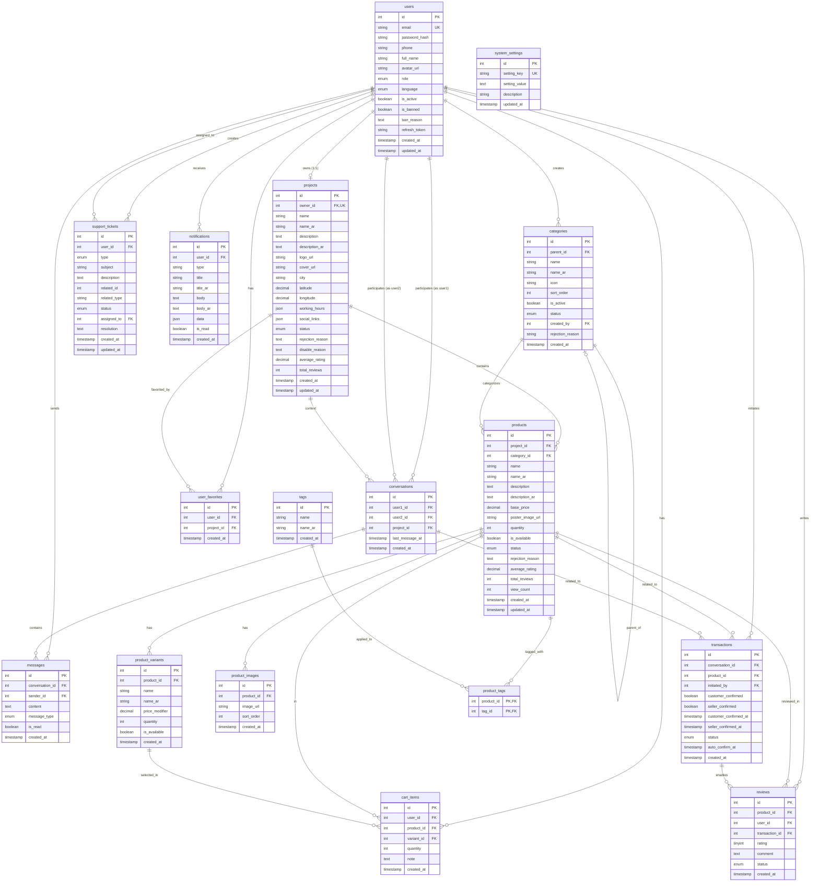

# Sinaa Database Documentation

> Complete database structure breakdown derived from migration files.

---

## Table of Contents
1. [Overview](#overview)
2. [Tables and Properties](#tables-and-properties)
3. [Entity Relationship Diagram (ERD)](#entity-relationship-diagram-erd)
4. [Data Flow Diagram (DFD)](#data-flow-diagram-dfd)
5. [Relationships Summary](#relationships-summary)
6. [Constraints Reference](#constraints-reference)
7. [Indexes Reference](#indexes-reference)

---

## Overview

The Sinaa database consists of **17 tables** organized into the following functional domains:

| Domain | Tables |
|--------|--------|
| **User Management** | `users` |
| **Project/Store Management** | `projects`, `user_favorites` |
| **Product Catalog** | `categories`, `products`, `product_images`, `product_variants`, `tags`, `product_tags` |
| **Shopping** | `cart_items` |
| **Communication** | `conversations`, `messages` |
| **Transactions** | `transactions`, `reviews` |
| **Support** | `support_tickets`, `notifications` |
| **System** | `system_settings` |

---

## Tables and Properties

### 1. `users`
Central user table storing all user accounts.

| Column | Type | Constraints | Description |
|--------|------|-------------|-------------|
| `id` | INTEGER | **PK**, AUTO_INCREMENT | Unique user identifier |
| `email` | VARCHAR(255) | **UNIQUE**, NOT NULL | User email address |
| `password_hash` | VARCHAR(255) | NOT NULL | Hashed password |
| `phone` | VARCHAR(20) | NULLABLE | Phone number |
| `full_name` | VARCHAR(100) | NOT NULL | User's full name |
| `avatar_url` | VARCHAR(500) | NULLABLE | Profile picture URL |
| `role` | ENUM | DEFAULT 'customer' | `customer`, `project_owner`, `admin` |
| `language` | ENUM | DEFAULT 'ar' | `ar`, `en` |
| `is_active` | BOOLEAN | DEFAULT true | Account active status |
| `is_banned` | BOOLEAN | DEFAULT false | Ban status |
| `ban_reason` | TEXT | NULLABLE | Reason for ban |
| `refresh_token` | VARCHAR(500) | NULLABLE | JWT refresh token |
| `created_at` | TIMESTAMP | DEFAULT CURRENT_TIMESTAMP | Creation timestamp |
| `updated_at` | TIMESTAMP | ON UPDATE CURRENT_TIMESTAMP | Last update timestamp |

**Indexes:** `email`, `role`, `is_active`

---

### 2. `projects`
Stores project/store information for project owners.

| Column | Type | Constraints | Description |
|--------|------|-------------|-------------|
| `id` | INTEGER | **PK**, AUTO_INCREMENT | Unique project identifier |
| `owner_id` | INTEGER | **FK→users.id**, **UNIQUE**, NOT NULL | Project owner reference |
| `name` | VARCHAR(100) | NOT NULL | Project name (English) |
| `name_ar` | VARCHAR(100) | NOT NULL | Project name (Arabic) |
| `description` | TEXT | NULLABLE | Description (English) |
| `description_ar` | TEXT | NULLABLE | Description (Arabic) |
| `logo_url` | VARCHAR(500) | NULLABLE | Logo image URL |
| `cover_url` | VARCHAR(500) | NULLABLE | Cover image URL |
| `city` | VARCHAR(100) | NOT NULL | City location |
| `latitude` | DECIMAL(10,8) | NULLABLE | GPS latitude |
| `longitude` | DECIMAL(11,8) | NULLABLE | GPS longitude |
| `working_hours` | JSON | NULLABLE | Working hours schedule |
| `social_links` | JSON | NULLABLE | Social media links |
| `status` | ENUM | DEFAULT 'pending' | `pending`, `approved`, `rejected`, `disabled` |
| `rejection_reason` | TEXT | NULLABLE | Reason for rejection |
| `disable_reason` | TEXT | NULLABLE | Reason for disabling |
| `average_rating` | DECIMAL(2,1) | DEFAULT 0 | Average rating score |
| `total_reviews` | INTEGER | DEFAULT 0 | Total review count |
| `created_at` | TIMESTAMP | DEFAULT CURRENT_TIMESTAMP | Creation timestamp |
| `updated_at` | TIMESTAMP | ON UPDATE CURRENT_TIMESTAMP | Last update timestamp |

**Indexes:** `owner_id`, `status`, `city`, `average_rating`

**FK Actions:** ON DELETE CASCADE, ON UPDATE CASCADE

---

### 3. `categories`
Product categories with hierarchical structure support.

| Column | Type | Constraints | Description |
|--------|------|-------------|-------------|
| `id` | INTEGER | **PK**, AUTO_INCREMENT | Unique category identifier |
| `parent_id` | INTEGER | **FK→categories.id**, NULLABLE | Parent category (self-reference) |
| `name` | VARCHAR(100) | NOT NULL | Category name (English) |
| `name_ar` | VARCHAR(100) | NOT NULL | Category name (Arabic) |
| `icon` | VARCHAR(100) | NULLABLE | Icon identifier |
| `sort_order` | INTEGER | DEFAULT 0 | Display order |
| `is_active` | BOOLEAN | DEFAULT true | Active status |
| `status` | ENUM | DEFAULT 'active' | `active`, `inactive`, `pending`, `rejected` |
| `created_by` | INTEGER | **FK→users.id**, NULLABLE | User who created the category |
| `rejection_reason` | VARCHAR(255) | NULLABLE | Reason for rejection |
| `created_at` | TIMESTAMP | DEFAULT CURRENT_TIMESTAMP | Creation timestamp |

**Indexes:** `parent_id`, `is_active`, `sort_order`, `status`

**FK Actions (parent_id):** ON DELETE SET NULL, ON UPDATE CASCADE

---

### 4. `products`
Main product catalog table.

| Column | Type | Constraints | Description |
|--------|------|-------------|-------------|
| `id` | INTEGER | **PK**, AUTO_INCREMENT | Unique product identifier |
| `project_id` | INTEGER | **FK→projects.id**, NOT NULL | Parent project reference |
| `category_id` | INTEGER | **FK→categories.id**, NOT NULL | Category reference |
| `name` | VARCHAR(200) | NOT NULL | Product name (English) |
| `name_ar` | VARCHAR(200) | NOT NULL | Product name (Arabic) |
| `description` | TEXT | NULLABLE | Description (English) |
| `description_ar` | TEXT | NULLABLE | Description (Arabic) |
| `base_price` | DECIMAL(10,2) | NOT NULL | Base price |
| `poster_image_url` | VARCHAR(500) | NOT NULL | Main product image |
| `quantity` | INTEGER | DEFAULT 0 | Stock quantity |
| `is_available` | BOOLEAN | DEFAULT true | Availability status |
| `status` | ENUM | DEFAULT 'pending' | `pending`, `approved`, `rejected` |
| `rejection_reason` | TEXT | NULLABLE | Reason for rejection |
| `average_rating` | DECIMAL(2,1) | DEFAULT 0 | Average rating |
| `total_reviews` | INTEGER | DEFAULT 0 | Total reviews count |
| `view_count` | INTEGER | DEFAULT 0 | View counter |
| `created_at` | TIMESTAMP | DEFAULT CURRENT_TIMESTAMP | Creation timestamp |
| `updated_at` | TIMESTAMP | ON UPDATE CURRENT_TIMESTAMP | Last update timestamp |

**Indexes:** `project_id`, `category_id`, `status`, `is_available`, `average_rating`, `created_at`

**FK Actions (project_id):** ON DELETE CASCADE, ON UPDATE CASCADE  
**FK Actions (category_id):** ON DELETE RESTRICT, ON UPDATE CASCADE

---

### 5. `product_images`
Additional product images.

| Column | Type | Constraints | Description |
|--------|------|-------------|-------------|
| `id` | INTEGER | **PK**, AUTO_INCREMENT | Unique image identifier |
| `product_id` | INTEGER | **FK→products.id**, NOT NULL | Product reference |
| `image_url` | VARCHAR(500) | NOT NULL | Image URL |
| `sort_order` | INTEGER | DEFAULT 0 | Display order |
| `created_at` | TIMESTAMP | DEFAULT CURRENT_TIMESTAMP | Creation timestamp |

**Indexes:** `product_id`

**FK Actions:** ON DELETE CASCADE, ON UPDATE CASCADE

---

### 6. `product_variants`
Product variants (sizes, colors, etc.).

| Column | Type | Constraints | Description |
|--------|------|-------------|-------------|
| `id` | INTEGER | **PK**, AUTO_INCREMENT | Unique variant identifier |
| `product_id` | INTEGER | **FK→products.id**, NOT NULL | Product reference |
| `name` | VARCHAR(100) | NOT NULL | Variant name (English) |
| `name_ar` | VARCHAR(100) | NOT NULL | Variant name (Arabic) |
| `price_modifier` | DECIMAL(10,2) | DEFAULT 0 | Price adjustment |
| `quantity` | INTEGER | DEFAULT 0 | Stock quantity |
| `is_available` | BOOLEAN | DEFAULT true | Availability status |
| `created_at` | TIMESTAMP | DEFAULT CURRENT_TIMESTAMP | Creation timestamp |

**Indexes:** `product_id`, `is_available`

**FK Actions:** ON DELETE CASCADE, ON UPDATE CASCADE

---

### 7. `tags`
Product tags for categorization.

| Column | Type | Constraints | Description |
|--------|------|-------------|-------------|
| `id` | INTEGER | **PK**, AUTO_INCREMENT | Unique tag identifier |
| `name` | VARCHAR(50) | NOT NULL | Tag name (English) |
| `name_ar` | VARCHAR(50) | NOT NULL | Tag name (Arabic) |
| `created_at` | TIMESTAMP | DEFAULT CURRENT_TIMESTAMP | Creation timestamp |

---

### 8. `product_tags` (Junction Table)
Many-to-many relationship between products and tags.

| Column | Type | Constraints | Description |
|--------|------|-------------|-------------|
| `product_id` | INTEGER | **PK**, **FK→products.id**, NOT NULL | Product reference |
| `tag_id` | INTEGER | **PK**, **FK→tags.id**, NOT NULL | Tag reference |

**Composite Primary Key:** (`product_id`, `tag_id`)

**Indexes:** `product_id`, `tag_id`

**FK Actions:** ON DELETE CASCADE, ON UPDATE CASCADE

---

### 9. `cart_items`
User shopping cart items.

| Column | Type | Constraints | Description |
|--------|------|-------------|-------------|
| `id` | INTEGER | **PK**, AUTO_INCREMENT | Unique cart item identifier |
| `user_id` | INTEGER | **FK→users.id**, NOT NULL | User reference |
| `product_id` | INTEGER | **FK→products.id**, NOT NULL | Product reference |
| `variant_id` | INTEGER | **FK→product_variants.id**, NULLABLE | Variant reference |
| `quantity` | INTEGER | DEFAULT 1 | Item quantity |
| `note` | TEXT | NULLABLE | Optional note |
| `created_at` | TIMESTAMP | DEFAULT CURRENT_TIMESTAMP | Creation timestamp |

**Unique Constraint:** `unique_cart_item` on (`user_id`, `product_id`, `variant_id`)

**Indexes:** `user_id`, `product_id`

**FK Actions (user_id, product_id):** ON DELETE CASCADE, ON UPDATE CASCADE  
**FK Actions (variant_id):** ON DELETE SET NULL, ON UPDATE CASCADE

---

### 10. `conversations`
Chat conversations between users.

| Column | Type | Constraints | Description |
|--------|------|-------------|-------------|
| `id` | INTEGER | **PK**, AUTO_INCREMENT | Unique conversation identifier |
| `user1_id` | INTEGER | **FK→users.id**, NOT NULL | First user (smaller ID) |
| `user2_id` | INTEGER | **FK→users.id**, NOT NULL | Second user (larger ID) |
| `project_id` | INTEGER | **FK→projects.id**, NULLABLE | Related project context |
| `last_message_at` | TIMESTAMP | NULLABLE | Last message timestamp |
| `created_at` | TIMESTAMP | DEFAULT CURRENT_TIMESTAMP | Creation timestamp |

**Unique Constraint:** `unique_user_pair` on (`user1_id`, `user2_id`)

**Indexes:** `user1_id`, `user2_id`, `project_id`, `last_message_at`

**FK Actions (user1_id, user2_id):** ON DELETE CASCADE, ON UPDATE CASCADE  
**FK Actions (project_id):** ON DELETE SET NULL, ON UPDATE CASCADE

---

### 11. `messages`
Chat messages within conversations.

| Column | Type | Constraints | Description |
|--------|------|-------------|-------------|
| `id` | INTEGER | **PK**, AUTO_INCREMENT | Unique message identifier |
| `conversation_id` | INTEGER | **FK→conversations.id**, NOT NULL | Conversation reference |
| `sender_id` | INTEGER | **FK→users.id**, NOT NULL | Sender reference |
| `content` | TEXT | NOT NULL | Message content |
| `message_type` | ENUM | DEFAULT 'text' | `text`, `inquiry`, `image`, `transaction` |
| `is_read` | BOOLEAN | DEFAULT false | Read status |
| `created_at` | TIMESTAMP | DEFAULT CURRENT_TIMESTAMP | Creation timestamp |

**Indexes:** `conversation_id`, `sender_id`, `is_read`, `created_at`

**FK Actions:** ON DELETE CASCADE, ON UPDATE CASCADE

---

### 12. `transactions`
Purchase transactions between users.

| Column | Type | Constraints | Description |
|--------|------|-------------|-------------|
| `id` | INTEGER | **PK**, AUTO_INCREMENT | Unique transaction identifier |
| `conversation_id` | INTEGER | **FK→conversations.id**, NOT NULL | Related conversation |
| `product_id` | INTEGER | **FK→products.id**, NULLABLE | Related product |
| `initiated_by` | INTEGER | **FK→users.id**, NOT NULL | User who initiated |
| `customer_confirmed` | BOOLEAN | DEFAULT false | Customer confirmation |
| `seller_confirmed` | BOOLEAN | DEFAULT false | Seller confirmation |
| `customer_confirmed_at` | TIMESTAMP | NULLABLE | Customer confirmation time |
| `seller_confirmed_at` | TIMESTAMP | NULLABLE | Seller confirmation time |
| `status` | ENUM | DEFAULT 'pending' | `pending`, `confirmed`, `disputed`, `cancelled` |
| `auto_confirm_at` | TIMESTAMP | NOT NULL | Auto-confirmation deadline |
| `created_at` | TIMESTAMP | DEFAULT CURRENT_TIMESTAMP | Creation timestamp |

**Indexes:** `conversation_id`, `product_id`, `initiated_by`, `status`, `auto_confirm_at`

**FK Actions (conversation_id):** ON DELETE CASCADE, ON UPDATE CASCADE  
**FK Actions (product_id):** ON DELETE SET NULL, ON UPDATE CASCADE  
**FK Actions (initiated_by):** ON DELETE RESTRICT, ON UPDATE CASCADE

---

### 13. `reviews`
Product reviews from customers.

| Column | Type | Constraints | Description |
|--------|------|-------------|-------------|
| `id` | INTEGER | **PK**, AUTO_INCREMENT | Unique review identifier |
| `product_id` | INTEGER | **FK→products.id**, NOT NULL | Reviewed product |
| `user_id` | INTEGER | **FK→users.id**, NOT NULL | Reviewer |
| `transaction_id` | INTEGER | **FK→transactions.id**, NOT NULL | Related transaction |
| `rating` | TINYINT | NOT NULL, CHECK (1-5) | Rating score |
| `comment` | TEXT | NULLABLE | Review comment |
| `status` | ENUM | DEFAULT 'pending' | `pending`, `approved`, `rejected` |
| `created_at` | TIMESTAMP | DEFAULT CURRENT_TIMESTAMP | Creation timestamp |

**Unique Constraint:** `unique_review` on (`product_id`, `user_id`, `transaction_id`)

**Indexes:** `product_id`, `user_id`, `status`, `rating`

**FK Actions (product_id, user_id):** ON DELETE CASCADE, ON UPDATE CASCADE  
**FK Actions (transaction_id):** ON DELETE RESTRICT, ON UPDATE CASCADE

---

### 14. `support_tickets`
Customer support tickets.

| Column | Type | Constraints | Description |
|--------|------|-------------|-------------|
| `id` | INTEGER | **PK**, AUTO_INCREMENT | Unique ticket identifier |
| `user_id` | INTEGER | **FK→users.id**, NOT NULL | Ticket creator |
| `type` | ENUM | NOT NULL | `general`, `dispute`, `report`, `feedback` |
| `subject` | VARCHAR(200) | NOT NULL | Ticket subject |
| `description` | TEXT | NOT NULL | Ticket description |
| `related_id` | INTEGER | NULLABLE | Related entity ID |
| `related_type` | VARCHAR(50) | NULLABLE | Entity type reference |
| `status` | ENUM | DEFAULT 'open' | `open`, `in_progress`, `resolved`, `closed` |
| `assigned_to` | INTEGER | **FK→users.id**, NULLABLE | Assigned admin |
| `resolution` | TEXT | NULLABLE | Resolution notes |
| `created_at` | TIMESTAMP | DEFAULT CURRENT_TIMESTAMP | Creation timestamp |
| `updated_at` | TIMESTAMP | ON UPDATE CURRENT_TIMESTAMP | Last update timestamp |

**Indexes:** `user_id`, `type`, `status`, `assigned_to`, `created_at`

**FK Actions (user_id):** ON DELETE CASCADE, ON UPDATE CASCADE  
**FK Actions (assigned_to):** ON DELETE SET NULL, ON UPDATE CASCADE

---

### 15. `notifications`
User notifications.

| Column | Type | Constraints | Description |
|--------|------|-------------|-------------|
| `id` | INTEGER | **PK**, AUTO_INCREMENT | Unique notification identifier |
| `user_id` | INTEGER | **FK→users.id**, NOT NULL | Target user |
| `type` | VARCHAR(50) | NOT NULL | Notification type |
| `title` | VARCHAR(200) | NOT NULL | Title (English) |
| `title_ar` | VARCHAR(200) | NOT NULL | Title (Arabic) |
| `body` | TEXT | NULLABLE | Body (English) |
| `body_ar` | TEXT | NULLABLE | Body (Arabic) |
| `data` | JSON | NULLABLE | Additional data |
| `is_read` | BOOLEAN | DEFAULT false | Read status |
| `created_at` | TIMESTAMP | DEFAULT CURRENT_TIMESTAMP | Creation timestamp |

**Indexes:** `user_id`, `type`, `is_read`, `created_at`

**FK Actions:** ON DELETE CASCADE, ON UPDATE CASCADE

---

### 16. `system_settings`
Application configuration settings.

| Column | Type | Constraints | Description |
|--------|------|-------------|-------------|
| `id` | INTEGER | **PK**, AUTO_INCREMENT | Unique setting identifier |
| `setting_key` | VARCHAR(100) | **UNIQUE**, NOT NULL | Setting key |
| `setting_value` | TEXT | NOT NULL | Setting value |
| `description` | VARCHAR(255) | NULLABLE | Setting description |
| `updated_at` | TIMESTAMP | ON UPDATE CURRENT_TIMESTAMP | Last update timestamp |

**Indexes:** `setting_key`

---

### 17. `user_favorites`
User's favorite projects.

| Column | Type | Constraints | Description |
|--------|------|-------------|-------------|
| `id` | INTEGER | **PK**, AUTO_INCREMENT | Unique favorite identifier |
| `user_id` | INTEGER | **FK→users.id**, NOT NULL | User reference |
| `project_id` | INTEGER | **FK→projects.id**, NOT NULL | Favorited project |
| `created_at` | TIMESTAMP | DEFAULT CURRENT_TIMESTAMP | Creation timestamp |

**Unique Constraint:** `user_favorites_user_project_unique` on (`user_id`, `project_id`)

**Indexes:** `user_id`, `project_id`

**FK Actions:** ON DELETE CASCADE, ON UPDATE CASCADE

---

## Entity Relationship Diagram (ERD)

---

## Data Flow Diagram (DFD)

```mermaid
flowchart TB
    subgraph External["External Entities"]
        CUSTOMER["👤 Customer"]
        PROJECT_OWNER["🏪 Project Owner"]
        ADMIN["👨‍💼 Admin"]
    end
    
    subgraph Processes["Core Processes"]
        P1["1.0 User Management"]
        P2["2.0 Project Management"]
        P3["3.0 Product Management"]
        P4["4.0 Shopping Cart"]
        P5["5.0 Messaging System"]
        P6["6.0 Transaction Processing"]
        P7["7.0 Review System"]
        P8["8.0 Support System"]
        P9["9.0 Notification System"]
    end
    
    subgraph DataStores["Data Stores"]
        D1[("users")]
        D2[("projects")]
        D3[("categories")]
        D4[("products")]
        D5[("product_images")]
        D6[("product_variants")]
        D7[("tags / product_tags")]
        D8[("cart_items")]
        D9[("conversations")]
        D10[("messages")]
        D11[("transactions")]
        D12[("reviews")]
        D13[("support_tickets")]
        D14[("notifications")]
        D15[("system_settings")]
        D16[("user_favorites")]
    end
    
    %% User flows
    CUSTOMER -->|"Register/Login"| P1
    PROJECT_OWNER -->|"Register/Login"| P1
    ADMIN -->|"Login"| P1
    P1 <-->|"User Data"| D1
    
    %% Project flows
    PROJECT_OWNER -->|"Create/Edit Project"| P2
    ADMIN -->|"Approve/Reject Project"| P2
    P2 <-->|"Project Data"| D2
    
    %% Product flows
    PROJECT_OWNER -->|"Add/Edit Products"| P3
    ADMIN -->|"Approve/Reject Products"| P3
    P3 <-->|"Product Data"| D4
    P3 <-->|"Images"| D5
    P3 <-->|"Variants"| D6
    P3 <-->|"Categories"| D3
    P3 <-->|"Tags"| D7
    
    %% Shopping flows
    CUSTOMER -->|"Add to Cart"| P4
    P4 <-->|"Cart Items"| D8
    P4 -.->|"Check Products"| D4
    P4 -.->|"Check Variants"| D6
    
    %% Messaging flows
    CUSTOMER -->|"Send Message"| P5
    PROJECT_OWNER -->|"Reply Message"| P5
    P5 <-->|"Conversations"| D9
    P5 <-->|"Messages"| D10
    
    %% Transaction flows
    CUSTOMER -->|"Confirm Purchase"| P6
    PROJECT_OWNER -->|"Confirm Sale"| P6
    P6 <-->|"Transaction Data"| D11
    P6 -.->|"Update via"| D10
    
    %% Review flows
    CUSTOMER -->|"Write Review"| P7
    ADMIN -->|"Moderate Review"| P7
    P7 <-->|"Reviews"| D12
    P7 -.->|"Requires"| D11
    
    %% Support flows
    CUSTOMER -->|"Create Ticket"| P8
    PROJECT_OWNER -->|"Create Ticket"| P8
    ADMIN -->|"Handle Ticket"| P8
    P8 <-->|"Tickets"| D13
    
    %% Notification flows
    P1 & P2 & P3 & P6 & P7 & P8 -->|"Trigger"| P9
    P9 <-->|"Notifications"| D14
    P9 -->|"Push Notification"| CUSTOMER
    P9 -->|"Push Notification"| PROJECT_OWNER
    
    %% Favorites
    CUSTOMER -->|"Add Favorite"| D16
    
    %% System settings
    ADMIN -->|"Configure"| D15
```

---

## Relationships Summary

### One-to-One (1:1)
| Parent | Child | FK Column | Description |
|--------|-------|-----------|-------------|
| `users` | `projects` | `owner_id` | Each user can own one project |

### One-to-Many (1:N)
| Parent | Child | FK Column | Description |
|--------|-------|-----------|-------------|
| `users` | `cart_items` | `user_id` | User's cart items |
| `users` | `support_tickets` | `user_id` | User's tickets |
| `users` | `notifications` | `user_id` | User's notifications |
| `users` | `reviews` | `user_id` | User's reviews |
| `users` | `messages` | `sender_id` | User's sent messages |
| `users` | `transactions` | `initiated_by` | User's initiated transactions |
| `users` | `user_favorites` | `user_id` | User's favorites |
| `users` | `categories` | `created_by` | User-created categories |
| `projects` | `products` | `project_id` | Project's products |
| `projects` | `conversations` | `project_id` | Project-related conversations |
| `projects` | `user_favorites` | `project_id` | Users who favorited project |
| `categories` | `categories` | `parent_id` | Category hierarchy (self-ref) |
| `categories` | `products` | `category_id` | Products in category |
| `products` | `product_images` | `product_id` | Product's images |
| `products` | `product_variants` | `product_id` | Product's variants |
| `products` | `cart_items` | `product_id` | Cart items with product |
| `products` | `reviews` | `product_id` | Product reviews |
| `products` | `transactions` | `product_id` | Related transactions |
| `product_variants` | `cart_items` | `variant_id` | Cart items with variant |
| `conversations` | `messages` | `conversation_id` | Messages in conversation |
| `conversations` | `transactions` | `conversation_id` | Transactions from conversation |
| `transactions` | `reviews` | `transaction_id` | Reviews for transaction |

### Many-to-Many (N:M)
| Table 1 | Table 2 | Junction Table | Description |
|---------|---------|----------------|-------------|
| `products` | `tags` | `product_tags` | Product tagging |
| `users` | `users` | `conversations` | User conversations |

---

## Constraints Reference

### Primary Keys
All tables use `id` (INTEGER, AUTO_INCREMENT) as primary key, except:
- `product_tags`: Composite PK (`product_id`, `tag_id`)

### Unique Constraints
| Table | Column(s) | Constraint Name |
|-------|-----------|-----------------|
| `users` | `email` | (implicit) |
| `projects` | `owner_id` | (implicit) |
| `system_settings` | `setting_key` | (implicit) |
| `cart_items` | `user_id`, `product_id`, `variant_id` | `unique_cart_item` |
| `conversations` | `user1_id`, `user2_id` | `unique_user_pair` |
| `reviews` | `product_id`, `user_id`, `transaction_id` | `unique_review` |
| `user_favorites` | `user_id`, `project_id` | `user_favorites_user_project_unique` |

### Foreign Key Actions Summary

| Action | Usage |
|--------|-------|
| `CASCADE` | Most common - deletes/updates propagate |
| `SET NULL` | Parent-child relationships where child can exist without parent (variants in cart, project in conversation) |
| `RESTRICT` | Critical relationships that must be preserved (category for products, transaction for reviews) |

---

## Indexes Reference

| Table | Indexed Columns |
|-------|-----------------|
| `users` | `email`, `role`, `is_active` |
| `projects` | `owner_id`, `status`, `city`, `average_rating` |
| `categories` | `parent_id`, `is_active`, `sort_order`, `status` |
| `products` | `project_id`, `category_id`, `status`, `is_available`, `average_rating`, `created_at` |
| `product_images` | `product_id` |
| `product_variants` | `product_id`, `is_available` |
| `product_tags` | `product_id`, `tag_id` |
| `cart_items` | `user_id`, `product_id` |
| `conversations` | `user1_id`, `user2_id`, `project_id`, `last_message_at` |
| `messages` | `conversation_id`, `sender_id`, `is_read`, `created_at` |
| `transactions` | `conversation_id`, `product_id`, `initiated_by`, `status`, `auto_confirm_at` |
| `reviews` | `product_id`, `user_id`, `status`, `rating` |
| `support_tickets` | `user_id`, `type`, `status`, `assigned_to`, `created_at` |
| `notifications` | `user_id`, `type`, `is_read`, `created_at` |
| `system_settings` | `setting_key` |
| `user_favorites` | `user_id`, `project_id` |

---

> **Document generated from migration files analysis**  
> **Last updated:** January 2026
